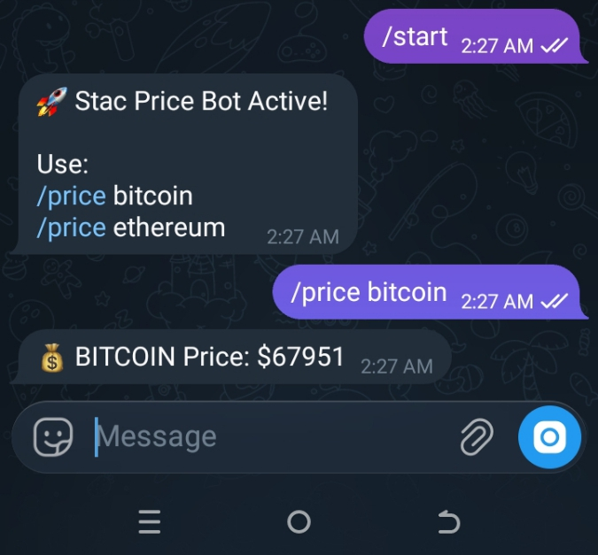

# 🚀 Stac Price Bot

> Intercom fork extended with a Telegram-based real-time crypto tracking agent.

Built by: @Uestace223

---

## 🧠 Overview

Stac Price Bot is a custom extension built on top of the Intercom peer infrastructure.

This fork integrates a Telegram bot interface that allows users and agents
to retrieve real-time cryptocurrency prices using CoinGecko API.

The project demonstrates how Intercom can be extended beyond messaging
into functional agent-based utilities.

---

## 🔥 Features

- 📲 Telegram Bot Integration
- 💰 Real-Time Crypto Price Tracking
- 🌐 CoinGecko API Powered
- ⚡ Lightweight & Termux Compatible
- 🤖 Agent-Ready Skill Extension

---

## ⚙️ Installation

### 1️⃣ Clone Repository

   - git clone https://github.com/Uestace223/stac.git
   - cd stac/telegram-crypto-bot

### 2️⃣ Install Dependencies

   - npm install

### 3️⃣ Set Telegram Token

   - export TELEGRAM_TOKEN=8527070673:AAGAlpsHTtjImavhnQIGKaMCUp54B6kp2UU

### 4️⃣ Run Bot

   - node index.js

---

## 📌 Usage

   /start
    /price bitcoin
    /price ethereum

---

## 💰 Trac Address

trac1vmq6gcx26f0k8537j3yrshl0pcfgrs2atdpknpsqpwkctzxq003s2mtudd

---

## 📸 Proof of Work

Below is proof that the application is running successfully:

The screenshot demonstrates:

- Stac Price Bot running
- Telegram interaction active
- Real-time price request functioning

